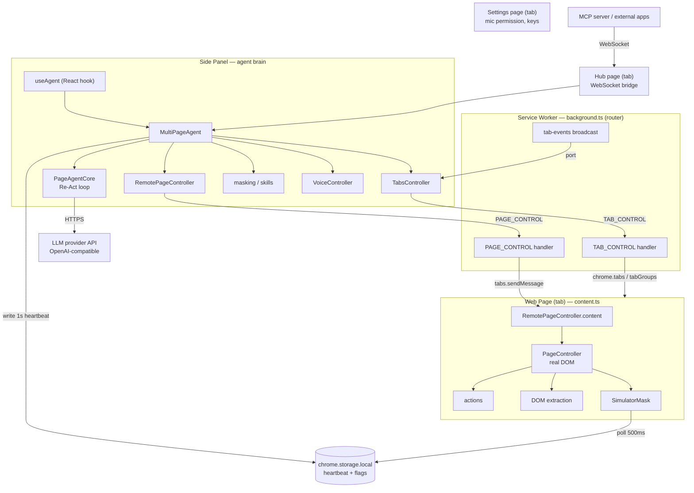
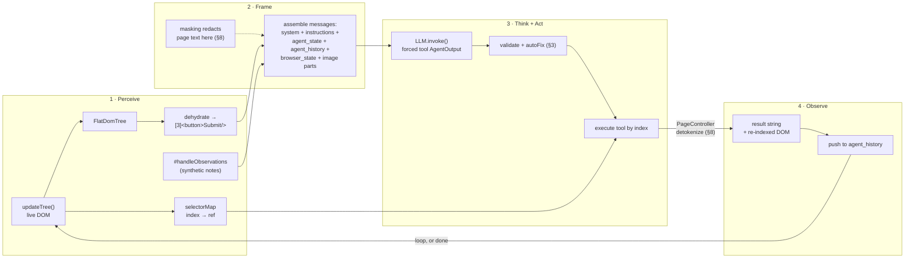

# Navvy — Extension Feature & Architecture Reference

Source material for the End-of-Project report and the website documentation. This document
catalogues **every feature** of the Navvy browser extension and explains, for each, **what it
does, how it is implemented, and why it was built that way**. All file/line references point at
the code as it exists on the `dev` branch (`packages/` workspace).

> Naming note: the product is **Navvy**, but the wire protocol, storage keys, IndexedDB names and
> message channels still carry the upstream `page-agent` / `PageAgentExt` identifiers. The rename
> lives at the UX / design-system layer, not the transport/storage layer.

---

## 0. Feature index (the short list)

The extension is an LLM-driven browser automation agent. A user states a goal in natural
language (typed or spoken); the agent perceives the page, reasons, and operates it on the user's
behalf. Its features:

1. **DOM perception** — converts a live page into a compact, indexed text description the LLM can read.
2. **Interactive-element detection** — decides which elements are operable and assigns each an index.
3. **The agent reasoning loop** — a Re-Act (reflect → act → observe) loop driving the LLM.
4. **Actions** — a tool set the LLM calls: click, type, select, scroll, keys, drag-and-drop, navigate, wait, ask, done, run JS.
5. **Action execution** — low-level, framework-safe DOM event simulation that performs each action.
6. **Visual feedback (SimulatorMask)** — an animated cursor + interaction-blocking overlay during automation.
7. **Multi-tab automation** — the agent can open, switch and close tabs and treat them as one task.
8. **Data masking** — keeps user-defined sensitive values out of the LLM context while still filling them into forms.
9. **Voice** — speech-to-text input and text-to-speech output, with a free browser path and four cloud providers.
10. **Skills / "Teach"** — record, refine, store and replay parameterised natural-language workflows.
11. **Conversation history** — IndexedDB-backed session storage with re-run, export and detail views.
12. **LLM provider configuration** — 17 provider presets, encrypted credential storage, connection testing.
13. **Keyboard shortcuts** — rebindable cancel + push-to-talk, working both in the panel and on the page.
14. **Internationalisation** — 7 UI locales plus a separate "agent response language" setting.
15. **Settings** — eight configuration sections.
16. **Hub + page API** — programmatic control of the agent from trusted pages and external apps (incl. an MCP server).
17. **Vision / image attachments** — screenshots or uploaded images fed to the model as multimodal input.
18. **Custom instructions & `llms.txt`** — system/page guidance and on-the-fly fetching of a site's `llms.txt`.

The rest of this document explains each in depth. Sections 1–6 are the engine
(`core`, `llms`, `page-controller`); sections 7–18 are extension features
(`packages/extension`). The appendices add an architecture diagram, three
end-to-end worked examples, a design-decisions/trade-offs catalogue, a
limitations list, a glossary, a key-file map, and — folded in from the former
"Under the Hood" research note — a commit-history decision catalog (Appendix F)
tracing each major decision through its *first approach → limitation → final
design → trade-off*. All written for direct reuse in the report.

---

## 0.1 System overview (the moving parts)

Navvy is a Manifest V3 extension with four UI/script surfaces plus a service worker. The
unusual design choice is that **the agent brain runs in the side-panel UI context**, not the
service worker — so DOM work has to be marshalled across process boundaries by message passing
(the RemotePageController pattern, §16).



| Surface | File | Role |
|---|---|---|
| Side panel | `entrypoints/sidepanel/App.tsx` | Primary UI; **hosts the agent loop** |
| Service worker | `entrypoints/background.ts` | Stateless router for `PAGE_CONTROL` / `TAB_CONTROL`; tab events; auth-token bootstrap |
| Content script | `entrypoints/content.ts` + `RemotePageController.content.ts` | Runs the real `PageController` in the page |
| Main world | `entrypoints/main-world.ts` | Exposes `window.PAGE_AGENT_EXT` to trusted pages |
| Settings | `entrypoints/settings/App.tsx` | Config; opens in a tab so it can prompt for mic permission |
| Hub | `entrypoints/hub/App.tsx` | WebSocket bridge for external apps / the MCP server |

## 0.2 Anatomy of one step (the data flow)

Every iteration of the agent loop is the same pipeline. Reading it once makes the rest of the
document fall into place:



Concretely (`PageAgentCore.execute`, `PageAgentCore.ts:263`):

1. **Perceive** — `getBrowserState()` runs `updateTree()`, producing the indexed text DOM and the
   `selectorMap` (index → live `ref`). `#handleObservations` injects synthetic system notes.
2. **Frame** — `#assembleUserMessageContent` builds the one user message: `<instructions>`,
   `<agent_state>`, `<agent_history>`, `<browser_state>` (+ image parts if any). If masking is
   active, `transformPageContent` redacts the page text here.
3. **Think + act** — `LLM.invoke` forces the `AgentOutput` tool; the client validates/auto-fixes
   the output and **executes the chosen sub-tool in the same round-trip**, which calls the
   PageController by index (un-masking values just before the DOM).
4. **Observe** — the tool's result string + the freshly re-indexed DOM become the next step's
   history and `<browser_state>`. Repeat until `done` or `maxSteps`.

---

## 1. DOM perception — turning a page into text

**What it does.** Before every reasoning step the agent needs a representation of the page the
LLM can consume. Navvy walks the live DOM, keeps only what matters, and renders it as an indented,
indexed text outline.

**How it works.** The extraction engine is `packages/page-controller/src/dom/dom_tree/index.js`
(a port of browser-use's `buildDomTree.js`, tagged `@match 0.5.9`; every Navvy change is marked
`@edit`). The pipeline has four stages, orchestrated from `PageController.updateTree`
(`PageController.ts:180`):

1. **Traverse → FlatDomTree.** `buildDomTree(document.body)` (`index.js:1480`, invoked at
   `index.js:1747`) recurses the DOM and emits a **flat hash map** keyed by string IDs rather than
   a nested tree (`type.ts:4` — `FlatDomTree { rootId, map }`). Each node stores its children's
   IDs, not the child objects (`index.js:1742`). Three `WeakMap` caches memoise `getBoundingClientRect`,
   `getClientRects` and `getComputedStyle` for the duration of one pass (`index.js:61-133`), cleared at
   the end (`index.js:1750`). *Why flat:* a flat map is cheap to serialise across the
   content-script/panel boundary and lets the selector map (§2) index nodes in O(1).

2. **Compute per-node facts.** For each element node it records `isVisible`, `isTopElement`,
   `isInViewport`, `isInteractive`, `highlightIndex`, `isNew`, and — critically — `ref: HTMLElement`,
   a **live reference to the actual DOM node** (`type.ts:48`). *Why a live ref:* browser-use re-resolves
   elements by XPath each time; Navvy keeps a direct handle (`@edit` at `index.js:1656`), which is faster
   and exact, at the cost that indices are only valid until the next `updateTree`.

3. **Dehydrate → text.** `flatTreeToString` (`dom/index.ts:193`) rebuilds a nested tree from the
   flat map and walks it, emitting one line per indexed element. Output shape:
   `[index]<tag attr=value>text />`, with `\t` indentation encoding nesting and `*[index]` marking
   elements that appeared since the last step. A representative slice (`dom/index.ts:175`):

   ```
   [0]<a aria-label=page-agent.js 首页 />
   [2]<div >page-agent.js
   UI Agent in your webpage />
   [5]<a role=button>快速开始 />
   ```

   Noise reduction: only an attribute allow-list survives (`DEFAULT_INCLUDE_ATTRIBUTES`,
   `dom/index.ts:198`); attributes duplicating the text or the tag are dropped; every value is capped
   at 20 chars; each element's text is collected only up to the next clickable descendant
   (`getAllTextTillNextClickableElement`, `dom/index.ts:466`) so text belongs to exactly one index.
   *Why:* token economy — the LLM gets the page's operable surface, not its markup.

4. **Wrap into BrowserState.** `PageController.getBrowserState` (`PageController.ts:135`) frames the
   content with a header (title, page-info line, "[Start of page]" / pixels-above hint) and footer
   ("[End of page]" / pixels-below), so the model has spatial context.

**Page metadata.** `getPageInfo` (`dom/getPageInfo.ts`) computes viewport/page size, scroll offsets,
`pixels_above/below/left/right`, `pages_above/below`, `total_pages` and `current_page_position`
(0-1). These feed the header scroll hints, telling the LLM how much page remains and where it is.

**Shadow DOM, iframes, rich text.** `buildDomTree` recurses into same-origin iframes (offsetting
highlight overlays by the iframe rect; cross-origin is caught and warned, `index.js:1680-1691`),
into open shadow roots (`index.js:1708`), and into `contenteditable` / TinyMCE bodies to preserve
formatted text (`index.js:1694`). Nodes with `aria-hidden="true"` or `data-page-agent-ignore` are
skipped with their subtrees (`index.js:1497-1504`).

**A property worth flagging.** The default `viewportExpansion` is `-1` ("full page",
`dom/index.ts:18`). At `-1` the in-viewport filter and the `elementFromPoint` hit-testing in
`isTopElement` are **bypassed** — every visible interactive element is indexed regardless of scroll
position or occlusion. The hit-testing logic only engages when expansion is set to `0` or positive.

---

## 2. Interactive-element detection — what gets an index, and how the index maps back

**What it does.** Decides which DOM nodes are operable (and therefore get a numeric `[index]`),
and how that index resolves to a real element when the LLM later acts on it.

**How "interactive" is decided.** Detection is layered (`isInteractiveElement`, `index.js:703`),
in priority order:

1. **Explicit black/whitelist** override (`index.js:711`).
2. **Computed cursor style — the primary heuristic** (`index.js:783`). If `cursor` is in the
   interactive set (`pointer, move, text, grab, cell, copy, all resize/zoom cursors`) the element is
   interactive. The code comments call this the "genius fix for almost all interactive elements."
   *Why:* event-listener inspection requires DevTools-only APIs (`getEventListeners`) that are absent
   in production, so cursor style is the most reliable cheap signal that a site author wired
   something up.
3. **Native interactive tags** (`a, button, input, select, textarea, details, summary, label,
   option, …`, `index.js:790`), unless disabled (`disabled`/`readonly`/`.inert`/non-interactive
   cursor, `index.js:820`).
4. **`contenteditable`** (`index.js:859`).
5. **Dropdown class/attribute heuristics** (`data-toggle="dropdown"`, `aria-haspopup`, …, `index.js:864`).
6. **ARIA roles** (`button, menuitem, tab, switch, slider, combobox, option, …`, `index.js:875`).
7. **Event listeners** (best-effort; usually inert in production, `index.js:906`).
8. **Scrollable containers** (Navvy `@edit`) — block-level elements with `overflow:auto/scroll`
   and real scroll distance ≥4px (`isScrollableElement`, `index.js:488`); these become operable so
   the agent can scroll inner regions.

**De-duplication.** To avoid indexing both a button and its inner `<span>`, `handleHighlighting`
(`index.js:1428`) only assigns an index when the node's parent wasn't already highlighted **or** the
node is a "distinct interaction" (`isElementDistinctInteraction`, `index.js:1300` — iframes, `li`,
`option`, `link`, test-id'd elements, scrollable containers, etc.). *Why:* one index per logical
control keeps the outline clean and the LLM's choices unambiguous.

**Gating.** Interactivity is computed only for nodes that are visible AND (the topmost element at
their position OR an ARIA menu container) (`index.js:1642-1651`). Visibility =
`offsetWidth/Height > 0 && visibility != hidden && display != none` (`isElementVisible`,
`index.js:684`).

**Index assignment.** `highlightIndex` is a dense counter (0,1,2,…) incremented in DOM-traversal
order whenever an element qualifies (`index.js:1452`). It is distinct from the internal hash-map ID.

**Mapping an index back to a node.** `getSelectorMap` (`dom/index.ts:496`) builds
`Map<number, InteractiveElementDomNode>` where each value still holds its live `ref`. At action time
`getElementByIndex` (`actions.ts:30`) looks up the node and returns `node.ref`, validating it with a
`nodeType === 1` check rather than `instanceof HTMLElement` (`utils/index.ts:4`) — *because
`instanceof` fails across iframe realms.* `assertIndexed` (`PageController.ts:241`) throws if an
action is attempted before the first `updateTree`. Indices are ephemeral: `updateTree` rebuilds the
map, simplified HTML and highlights on every step (`PageController.ts:208`).

---

## 3. The agent reasoning loop

**What it does.** Coordinates perceive → think → act → observe until the task is done or the step
budget is exhausted.

**How it works.** The loop is `PageAgentCore.execute()` — an unbounded `while (true)`
(`PageAgentCore.ts:263`). Each iteration:

1. **Observe** — `getBrowserState()` pulls the indexed DOM; `#handleObservations` injects synthetic
   system notes (URL-changed, "stop waiting", step-budget warnings at 5 and 2 steps left)
   (`PageAgentCore.ts:271-274, 566`).
2. **Assemble prompt** — system message (`system_prompt.md` with the working-language line patched)
   + a single user message containing `<instructions>`, `<agent_state>` (verbatim user request +
   "Step N of MAX"), `<agent_history>` (the running memory stream), and `<browser_state>` (the
   indexed DOM) (`#assembleUserPrompt`, `PageAgentCore.ts:621`).
3. **Think + act (fused)** — the LLM is forced to call one tool, `AgentOutput`. The OpenAI client
   parses, validates and **executes the chosen sub-tool in the same round-trip**
   (`OpenAIClient.ts:233`), so the action runs before control returns.
4. **Record + loop** — the reflection + result are pushed to history; if the action was `done` the
   loop exits, otherwise it waits `stepDelay` (default 0.4s) and repeats. `maxSteps` defaults to 40
   (`PageAgentCore.ts:119`); exceeding it returns a failure.

**Reflect-before-act.** The model never returns a bare action. Its output is a reflection envelope
(`MacroToolInput`, `types.ts:190`):

```ts
{ evaluation_previous_goal, memory, next_goal, action: { "<tool>": { ...params } } }
```

`evaluation_previous_goal` judges the last action (success/failure/uncertain); `memory` is durable
progress notes (counts, items found, pages visited); `next_goal` is the immediate plan; `action` is
exactly one tool call. *Why:* forcing an explicit self-assessment each step is what gives the agent
continuity and stops it from assuming success just because an action executed — the reflection is
re-rendered into `<agent_history>` for the next step (`PageAgentCore.ts:300, 654`). The schema is
enforced with Zod (`#packMacroTool`, `PageAgentCore.ts:391`); all three reflection fields are
optional. (The validated brain contract is exactly these three fields plus `action` — there is no
separate `thinking` field. Note the unrelated `{type:'thinking'}` *activity* event below is a
transient UI signal, not a model output field.)

**Two information streams** (`PageAgentCore.ts:69`): *history events* are persistent and fed to the
LLM; *activity events* (`thinking`/`executing`/`retrying`/`error`) are transient UI feedback and
**never** sent to the model. Errors are deliberately excluded from LLM context so they don't pollute
reasoning (`PageAgentCore.ts:667`).

**Retry & auto-fix.** `LLM.invoke` wraps the call in `withRetry` (`llms/src/index.ts:104`): up to
`maxRetries` attempts with exponential backoff + jitter, honouring provider `Retry-After` hints,
never retrying on abort or non-retryable errors. HTTP status is classified into typed `InvokeError`s
(auth, quota, rate-limit, server, context-length, content-filter) in `OpenAIClient.ts:92`.
Malformed model output is repaired by `autoFixer.ts` before execution: it unwraps extra layers,
extracts JSON from `content`, coerces primitives into the expected object (e.g.
`{"click_element_by_index": 2}` → `{index: 2}`), and falls back to `{wait:{seconds:1}}` if no action
is present (`autoFixer.ts:21-128`). A Groq-specific workaround mirrors action names as dummy tools
because Groq rejects names that don't match the request (`OpenAIClient.ts:322`). *Why:* model
providers diverge in how they emit tool calls; auto-fixing keeps the loop alive instead of crashing
on a formatting quirk.

**System prompt directives** (`core/src/prompts/system_prompt.md`): act only on provided numeric
indices; re-analyse after typing (dropdowns may appear); don't repeat an action >3× without change;
can't solve captchas (finish and tell the user); single-page focus; **failing honestly is
acceptable** — better than harmful forced actions; call `done` with `success=true` only when fully
complete. The extension swaps in a near-identical prompt that adds tab awareness
(`extension/src/agent/system_prompt.md`).

---

## 4. Actions (the tool set the LLM can call)

**What they are.** The LLM's vocabulary. Each tool has a description, a Zod input schema, and an
`execute` returning a result string that becomes "Action Results" in history
(`core/src/tools/index.ts`).

| Tool | Parameters | Purpose |
|---|---|---|
| `done` | `text`, `success=true` | Terminate the task; must be the only action in its step |
| `wait` | `seconds` (1-10) | Pause; subtracts LLM call time from the sleep |
| `ask_user` | `question` | Ask the user (only if an `onAskUser` callback exists) |
| `click_element_by_index` | `index` | Click an element |
| `input_text` | `index`, `text` | Focus + type into a field |
| `select_dropdown_option` | `index`, `text` | Pick a native `<select>` option by text |
| `scroll` | `down`, `num_pages`, `pixels?`, `index?` | Scroll the page, or a container by index |
| `scroll_horizontally` | `right`, `pixels`, `index?` | Horizontal scroll |
| `send_keys` | `keys` | Key combos (`ctrl+a`, `Enter`, `Tab Enter`) |
| `go_back` | — | Browser back |
| `scroll_to_text` | `text` | Find text and scroll it into view |
| `get_dropdown_options` | `index` | Read a native `<select>`'s options |
| `drag_and_drop` | `source_index`, `target_index` | Drag one element onto another |
| `execute_javascript` | `script` | Run arbitrary JS (experimental, opt-in) |

**Extension-added tools** (merged via `customTools`, `MultiPageAgent.ts:92`): `open_new_tab(url)`,
`switch_to_tab(tab_id)`, `close_tab(tab_id)` (§7), plus masking-overridden tools (§8) and dynamic
`skill_<name>` tools (§10).

**How targeting works.** There is no separate "find the element" step — the LLM names a numeric
`index` straight from the `<browser_state>` outline, and the tool calls the PageController by that
index. Tabs are targeted by `tab_id`, scroll containers by the index of a `data-scrollable` element.
The system prompt hard-constrains the model to "only use indexes that are explicitly provided."

**Tool-set mutation** (`PageAgentCore.ts:152`): `customTools` can add/override/remove tools;
`execute_javascript` is removed unless explicitly enabled; on "restricted" providers (the demo
proxy) every tool flagged `requiresFullProvider` is stripped; `ask_user` is removed when no callback
is wired. *Why:* the demo backend accepts only a canonical tool set, and security-sensitive tools
should be off by default.

**One action per step.** `parallel_tool_calls: false` (`OpenAIClient.ts:55`) and a single-key
`action` schema mean plans emerge step-by-step from the loop, not from batched calls — each action's
result and a freshly re-indexed DOM inform the next.

---

## 5. Action execution — framework-safe DOM simulation

**What it does.** Turns "click index 7" / "type X into index 3" into real DOM events that even
React/antd-controlled widgets accept. Lives in `packages/page-controller/src/actions.ts` (pure
functions) exposed through async `PageController` methods that return `{success, message}`.

**Click** (`clickElement`, `actions.ts:71`). Rather than `el.click()`, it dispatches the full
W3C Pointer + Mouse event cascade, because many sites only respond to low-level handlers
(hover menus, custom widgets):
1. Clear prior hover/focus (`blurLastClickedElement`, `actions.ts:53`).
2. Scroll the element (and its iframe) into view (`actions.ts:76`).
3. Move the visual cursor and play a click animation (§6).
4. Hit-test the real target with `elementFromPoint` (temporarily passing the mask through), so the
   *deepest* element at the coordinates is used, matching real browser behaviour (`actions.ts:89`).
5. Dispatch in spec order: `pointerover/enter → mouseover/enter → pointerdown → mousedown → focus →
   pointerup → mouseup → click` (`actions.ts:100-130`). Focus targets the original indexed element
   (the focusable ancestor), placed between mousedown and mouseup as browsers do.

**Text input** (`inputTextElement`, `actions.ts:138`). It first clicks (to focus / trigger
open-on-focus), then branches:
- *Native inputs/textareas:* uses the **native value setter pulled off the element's prototype**
  (`getNativeValueSetter`, `utils/index.ts:39`) to bypass React's instance-level `value` override,
  then dispatches real `beforeinput`/`input` `InputEvent`s. *Why:* `el.value = x` is invisible to
  React (it overrides the setter and never sees the assignment); the native setter + synthetic
  `input` event is what makes controlled React/antd inputs register the change. Reading the setter
  from the element's own prototype keeps it iframe-safe. The field is deliberately **not blurred**
  afterward, so typeaheads/autosuggest stay open (`actions.ts:266`).
- *contenteditable:* a two-plan strategy — synthetic `beforeinput`/`input` first (React/Quill),
  falling back to `execCommand('insertText')` if the text didn't land (Slate/Quill)
  (`actions.ts:146-228`). Monaco/CodeMirror/Draft.js are documented as unsupported.

**Other actions.** `selectOptionElement` matches an `<option>` by text and dispatches `change`
(`actions.ts:276`). `scrollVertically/Horizontally` walks up to 10 ancestors to find a real
scrollable container (or scrolls the window), moving `numPages × viewport` or explicit `pixels`
(`actions.ts:313`). `sendKeys` parses `ctrl+shift+a`-style combos and dispatches `keydown`/`keyup`
to the active element (no text mutation — use `input_text` for characters) (`actions.ts:459`).
`dragAndDrop` fires both Pointer/Mouse and HTML5 `DragEvent`s with a shared `DataTransfer` across 8
interpolated steps, covering both native DnD and pointer-based libraries (`actions.ts:569`).
`goBack`, `scrollToText` (TreeWalker text search), and `executeJavascript` (async `eval`) round it
out.

**Framework patches.** `patchReact` (`patches/react.ts`) tags React roots
(`[data-reactroot]`, `#root`, …) as non-interactive so React's root-level event delegation doesn't
make the whole app look clickable. (A dead `patchAntd` no-op was removed; antd custom selects are
operated via the generic click + input path like any other widget.)

**Error & staleness handling.** No per-action retry exists at this layer — each action runs once and
returns `{success:false, message:"❌ …"}` on failure (surfaced to the LLM, never silently swallowed,
per the project's "make errors visible" rule). Staleness is handled by re-indexing between steps
rather than node revalidation; the only guard is `assertIndexed`. A post-click navigation that tears
down the content script is reported as a *successful* click ("page navigated before response") rather
than a spurious error (`RemotePageController.ts:120`).

---

## 6. Visual feedback — the SimulatorMask

**What it does.** Shows an animated cursor gliding to each target, plays a click ripple, glows a
border around the viewport while the agent runs, and blocks the human from interfering mid-task.

**How it works** (`page-controller/src/mask/SimulatorMask.ts`). It is **optional**
(`enableMask: true`) and lazily imported to avoid loading CSS in Node (`PageController.ts:108`). It
is fully **decoupled from the action layer via window CustomEvents** (`PageAgent::MovePointerTo`,
`::ClickPointer`, `::EnablePassThrough`, `::DisablePassThrough`) emitted from `utils/index.ts`, so
the mask can be torn down independently. The cursor is an SVG arrow derived from the Navvy logo,
eased toward its target at 8%/frame via `requestAnimationFrame` for a smooth glide
(`SimulatorMask.ts:191`). A full-screen wrapper `stopPropagation`s user input; `enable/disablePassThrough`
briefly lets the click's `elementFromPoint` hit-test see through it. Cursor position survives
navigations by persisting to `sessionStorage` + `chrome.storage.local` and restoring (scaled to the
new viewport) on the next page, so it doesn't jump. *Why an interaction-blocking overlay:* prevents
the human and the agent from fighting over the same page during automation.

---

## 7. Multi-tab automation

**What it does.** Lets one task span several tabs — the agent can open a new tab, switch between
tabs, and close them, with all task tabs collected into a named Chrome tab group.

**How it works.** Three pieces, split across the panel and the service worker:
- `agent/TabsController.ts` (panel side) holds `currentTabId` and the `tabs[]` list, and sends
  `TAB_CONTROL` messages to the SW. `init` finds the active tab, optionally adopts the initial tab
  or (experimentally) all unpinned allowed tabs, and groups them. It asks the LLM for a 1-2 word
  Title-Case group name (`summarizeTaskTitle`, `:249`), falling back to a heuristic. A long-lived
  `chrome.runtime.connect({name:'tab-events'})` port keeps the list live, auto-switching to new tabs
  and dropping closed ones (`:390`).
- `agent/TabsController.background.ts` is the SW handler wrapping `chrome.tabs` / `chrome.tabGroups`
  and broadcasting tab events to all ports.
- `agent/tabTools.ts` exposes `open_new_tab` / `switch_to_tab` / `close_tab` to the LLM (`:24`).

`summarizeTabs()` renders a markdown table (`Tab ID | URL | Title | Current`) prepended to every
browser-state header (`RemotePageController.ts:81`) so the LLM always sees the full tab list and can
target any tab by id. `onBeforeStep` waits for the current tab to finish loading before each step.

**Why this architecture.** The agent's brain runs in the panel UI, but `chrome.tabs`/`chrome.tabGroups`
live in the service worker and DOM ops live in content scripts — so the controller is a thin
message-passing client (see §16 for the RemotePageController pattern that makes this work).

---

## 8. Data masking

**What it does.** Keeps user-defined sensitive values (card numbers, SSNs, passwords) out of the
LLM context, while still letting the agent fill them into forms. **Threat model:** exfiltration of
PII to the third-party LLM provider.

**How it works** (`agent/masking.ts`). Detection is **not** automatic — there is no regex/ML entity
recognition. The user defines exact-match rules (`MaskingEntry`: `token`, `label`, `value`,
`enabled`, `sensitive`, `group`). Two flows:
- **Outbound (page → LLM):** `redactSensitive` replaces each sensitive value's literal occurrences
  in the page text with `{{token}}`, sorted longest-value-first so overlapping values don't clobber
  each other (`masking.ts:96`). It hooks the core's `transformPageContent` seam, applied **after DOM
  dehydration, immediately before the LLM call** (`PageAgentCore.ts:677`,
  `MultiPageAgent.ts:98`). `buildMaskingInstructions` tells the model which tokens exist (label only,
  never the value) so it can type `{{token}}` into fields.
- **Inbound (LLM → page):** `createMaskingTools` overrides `input_text`, `select_dropdown_option`
  and `send_keys` with versions that `detokenize` `{{token}}` → real value **at the last moment
  before the DOM**, then **re-mask the tool's echo message** before it returns to history
  (`masking.ts:135`). *Why both halves:* PageController normally echoes the typed text in its success
  message, which would leak the real value back into the model's context; re-masking the echo closes
  that loop. The real value is therefore never serialised into the model context in either direction.

**The `sensitive` flag** distinguishes true secrets (redact outbound **and** fill inbound) from mere
autofill data like name/address (`sensitive:false` — fill inbound only, visible to the model by
design).

**Defence in depth.** While any masking entry is active, the experimental `execute_javascript` tool
is **force-disabled** (`MultiPageAgent.ts:145`) because arbitrary JS could read the real DOM value
and bypass masking entirely. Values are encrypted at rest with AES-GCM (§12).

**Configuration** (`MaskingSection.tsx`). Per-entry label/token/value (password-masked when
sensitive)/group, plus `sensitive` and `enabled` toggles, an "Add address group" template, and
save-time validation requiring both token and value. Masking is "active" simply when ≥1 active entry
exists (no master switch).

**Limitations.** Exact-substring matching only — a value reformatted on the page (e.g. `4111-1111`
vs stored `4111 1111`) won't be redacted; unknown `{{tokens}}` pass through untouched; only the three
overridden tools re-mask their output.

---

## 9. Voice

**What it does.** Talk to the agent (speech-to-text input) and have it talk back (text-to-speech
output). Voice is UI-layer only — it never enters `PageAgentCore`.

**STT flow** (`voice/`). For network providers, `MicRecorder` captures audio via `MediaRecorder`
(preferring Opus/WebM, `MicRecorder.ts:9`) and buffers the **whole utterance** into one Blob — there
is no streaming; the Blob is sent as a single batch REST call. The free **Web Speech** path
(`webspeech.ts`) captures and transcribes itself via `SpeechRecognition`, so it bypasses
`MicRecorder` entirely. Mic permission is tricky: a Chrome side panel can't show the permission
prompt, so the Voice settings (which open in a tab) request it there, and permission then carries to
the panel (`micPermission.ts`).

**Providers** (`agent/voiceProviders.ts`). Five: `webspeech` (free, browser, default for both
directions), `openai`, `groq` (STT-only), `elevenlabs`, `deepgram`. The cloud clients live in
`packages/llms/src/audio/` and are all **batch REST over `fetch`** (no WebSockets/streaming):
OpenAI-compatible (also backs Groq, configurable base URL), ElevenLabs (Scribe STT / strong TTS,
`xi-api-key` auth), Deepgram (low-latency STT with raw-bytes body, Aura TTS, `Token` auth). STT and
TTS providers are chosen **independently**.

**TTS flow.** `VoiceController.speak()` cancels any in-progress playback (barge-in), then either uses
Web Speech `SpeechSynthesisUtterance` or fetches an audio Blob from the cloud TTS client and plays
it via an `HTMLAudioElement`, revoking the object URL afterward to avoid leaks
(`VoiceController.ts:122`).

**Orchestration** (`VoiceController.ts`). States: `idle | recording | transcribing | speaking`,
broadcast via `statechange` events the panel renders. Both **push-to-talk** (hold the configured
key, `App.tsx:234`) and **toggle/continuous** (mic button, `App.tsx:215`) are implemented in the
panel. Transcripts feed the agent through `useAgent.ts`: a normal transcript starts a task; a
transcript arriving during an `ask_user` is routed to that pending question instead; and if
`autoSpeakResponses` is on, the agent's final answer is spoken (`useAgent.ts:128-210`).

**Configuration** (`VoiceSection.tsx`). Enable toggle, mic-permission grant, independent STT/TTS
provider/model/voice (editable comboboxes allowing custom IDs), per-direction API-key fields
(OpenAI-compatible providers can reuse the chat key when the host matches), live **Test STT**
(record→transcribe round-trip) and **Test TTS** (synthesize→play), a language hint, and auto-speak.

---

## 10. Skills / "Teach"

**What it does.** Lets a user record a workflow once and replay it as a reusable, parameterised
command — e.g. "fill this expense form" with the amounts as parameters.

**How it works** (`agent/skills.ts`). A `Skill` has a tool-safe `name`, `description`, `urlPattern`
(glob or `/regex/`), typed `parameters`, and a natural-language `plan` with `{name}` placeholders.
Two engine mechanisms:
- **Invocation:** `createSkillTools` registers a `skill_<name>` tool per active skill, whose schema
  is built from its parameters. `execute` interpolates the arguments into the plan and returns it as
  an authoritative ordered sub-task for the normal loop to carry out (`skills.ts:163`). *Why
  re-plan instead of replaying recorded clicks:* DOM indices are ephemeral and pages drift; a
  natural-language plan re-grounded each run is far more robust than index replay.
- **Discovery:** `buildSkillInstructions` lists only skills whose `urlPattern` matches the current
  URL, injected per-step, so the planner only hears about applicable skills (`skills.ts:210`).

**Refiner** (`skillRefiner.ts`). A raw narration is turned into a structured `Skill` by one
forced-tool LLM call (`emit_skill`) that extracts variables into `{param}` placeholders and
describes targets by visible label/role, not DOM indices.

**Authoring.** (1) The **Teach screen** (`TeachScreen.tsx`, the graduation-cap button): narrate by
voice or type, hit "Refine", edit the draft, save. (2) **Settings → Skills**: refine-from-text,
enable/disable, re-refine, edit, delete. Skills are stored unencrypted in
`chrome.storage.local.skills`. Because they add tool names, skills are disabled on restricted
providers (the demo proxy).

---

## 11. Conversation history

**What it does.** Persists each completed run so it can be reviewed, re-run, or exported.

**How it works.** `lib/db.ts` defines an IndexedDB store `sessions` (DB `page-agent-ext`), keyed by
id with a `by-created` index; a `SessionRecord` is `{id, task, history, status, createdAt}`. The
panel saves a session when a run finishes with non-empty history (a user-stopped run is stored as
`error`) (`sidepanel/App.tsx:84`). `HistoryList.tsx` shows a newest-first list with status icon,
task, relative time and step count, plus per-row re-run / export / delete and a "Clear all".
`HistoryDetail.tsx` renders the stored event stream read-only. `lib/history-export.ts` serialises a
session to pretty JSON and downloads it as `page-agent-history-<slug>-<timestamp>.json`.

---

## 12. LLM provider configuration & credential security

**What it does.** Lets the user point Navvy at any of 17 LLM providers (or a custom endpoint) and
stores their credentials securely.

**How it works** (`agent/providers.ts`). 17 presets — `navvyDemo`, `openai`, `anthropic`, `gemini`,
`groq`, `deepseek`, `mistral`, `openrouter`, `xai`, `together`, `fireworks`, `cerebras`,
`perplexity`, `nvidia`, `cloudflare`, `ollama`, `custom` — each with a base URL, curated model list
(with per-model `supportsImages` flags), and key/account requirements. `navvyDemo` sets
`restrictsSystemPrompt`, which disables skills, tab-title summarisation and free-form tools.
`ProvidersSection.tsx` provides the dropdown, conditional fields, an image-capability indicator, a
real **Test Connection** ping, and per-provider credential memory (switching providers stashes and
restores keys so they aren't re-typed).

**Credential security** (`lib/crypto.ts`). Secrets are encrypted at rest with **AES-GCM-256** using
a random, **non-extractable** `CryptoKey` stored in a separate IndexedDB DB (`page-agent-keys`); the
raw key bytes never touch disk. Ciphertext is tagged `enc:v1:` so legacy plaintext passes through,
and a one-time migration re-encrypts any plaintext on load. Only secret fields (API keys, voice
keys, masking values) are encrypted — provider/model/baseURL stay readable for debuggability.
*Explicit non-goal:* this defeats casual disk/backup inspection, not code running inside the
extension context.

---

## 13. Keyboard shortcuts

**What it does.** A one-key "stop the agent" and a hold-to-talk mic key, working both in the panel
and while the user is looking at the page.

**How it works.** A built-in Chrome command `Ctrl/Cmd+E` opens the side panel (`_execute_action`,
`wxt.config`). Everything else is **JS `keydown`/`keyup` listeners**, not Chrome commands — *because
Chrome commands require a modifier (no bare single keys) and fire once with no key-up, so
hold-to-talk is inexpressible.* `lib/shortcuts.ts` defines a rebindable `ShortcutsConfig`
(`pttKeyCode` default `Backquote`, `cancelKeyCode` default `Escape`), matched on physical
`KeyboardEvent.code` (layout-independent). The panel handles keys when focused (Esc cancels only
while running, so it doesn't hijack normal typing); `lib/contentShortcuts.ts` listens on the page and
relays `VOICE_PTT_DOWN/UP` and `CANCEL_ACTION` to the panel — *because the user is usually looking at
the page, not the panel.* The trade-off (stated openly): content-script listeners can't run on
`chrome://`, the Web Store, or PDF pages. Editable via **Settings → Shortcuts** with a key-capture
widget.

---

## 14. Internationalisation

**What it does.** Localises the UI and, separately, controls what language the agent answers in.

**How it works** (`lib/i18n.tsx`). A React context with `{{param}}` interpolation and English
fallback. **7 UI locales**: `en-US`, `fr-FR`, `de-DE`, `es-ES`, `it-IT`, `pt-PT`, `tr-TR`
(`lib/locales.ts`), with `en-US` as the canonical schema every other locale conforms to. Two
**distinct** settings: the **UI language** (defaults to the browser's), and the **agent response
language** (`'auto'` = mirror the user's task language, else a directive injected into the system
prompt, `MultiPageAgent.ts:66`). The extension name/description are localised via MV3 `__MSG_*`
placeholders. Language changes live-update via `storage.onChanged`.

---

## 15. Settings (the eight sections)

`settings/App.tsx` is a vertical-tabbed page (deep-linkable via URL hash) with a dirty-state
save/cancel bar and validation gating:

1. **General** — UI language + agent response language.
2. **Providers** — LLM provider, base URL, account ID (Cloudflare), API key, model, Test Connection (§12).
3. **Masking** — sensitive/autofill value entries (§8).
4. **Voice** — enable, mic permission, STT/TTS providers, tests, auto-speak (§9).
5. **Shortcuts** — rebind cancel + push-to-talk (§13).
6. **Skills** — refine-from-text + manage saved skills (§10).
7. **Advanced** — `maxSteps` (1-200), custom `systemInstruction`, and toggles:
   `disableNamedToolChoice` (for providers that reject named `tool_choice`), `experimentalLlmsTxt`,
   `experimentalIncludeAllTabs`.
8. **About** — the page **User Auth Token** (masked, with reveal/copy), Manage Hub link, version, and
   repo/site/privacy links.

---

## 16. Extension architecture, Hub & page API

**Runtime surfaces** (`wxt.config`): a **service worker** (`background.ts`, a thin message router),
a **content script** on `<all_urls>` (`content.ts`), a **main-world script** (`main-world.ts`,
injected into the page's JS context), the **side panel** (the primary UI), a **settings page** (opens
in a tab so it can request mic permission and is deep-linkable), and a **Hub page**. Permissions:
`tabs`, `tabGroups`, `sidePanel`, `storage`, `host_permissions: <all_urls>`.

**Where the agent runs.** Unusually, the agent's brain (`MultiPageAgent`/`PageAgentCore`) runs in the
**panel UI context**, not the service worker. The SW is just a router.

**The RemotePageController pattern.** DOM ops must reach an arbitrary tab's content script, but the
agent lives in the panel — so the `PageController` interface is implemented as a message-passing
proxy split across three files:
- `RemotePageController.ts` (agent side) packages each call as a `{type:'PAGE_CONTROL', action,
  targetTabId, payload}` message.
- `RemotePageController.background.ts` (SW) re-dispatches it to the target tab's content script and
  relays the response, classifying navigation-induced disconnects as `{disconnected:true}` rather
  than failures.
- `RemotePageController.content.ts` (every page) lazily creates a real `PageController` and runs the
  action.

Mask coordination uses **storage polling, not messaging**: the content script ticks every 500ms,
showing the mask only when the agent is running (fresh heartbeat written every 1s) and this is the
current tab — *because the side-panel `unload` event is unreliable, the heartbeat is a deliberate
backup.* Restricted URLs (`chrome://`, `file://`, devtools, …) are gated by `isContentScriptAllowed`,
which returns a structured failure telling the agent to open a real web page.

**Page-exposed API.** A trusted page can drive the agent if it echoes the extension's
`PageAgentExtUserAuthToken` in `localStorage`; `main-world.ts` then publishes
`window.PAGE_AGENT_EXT = {version, execute, stop}`, bridged over postMessage to a singleton agent and
streaming status/activity/history events back.

**Hub** (`entrypoints/hub/`). A programmatic control surface for **external apps**. An external
`OPEN_HUB` message opens a pinned `hub.html?ws=PORT` tab that connects as a WebSocket *client* to
`ws://localhost:PORT`, runs one task at a time, and speaks a small JSON protocol
(`execute`/`stop` in; `ready`/`result`/`error` out). Connections require user approval (or
auto-approve if enabled).

A companion **MCP server** (`packages/mcp`, published as `@page-agent/mcp`, binary
`page-agent-mcp`) lets any MCP client (Claude Desktop, IDEs, etc.) drive the real browser. It is a
stdio MCP server exposing a single tool, `execute_task(task)` (`mcp/src/index.js`); internally it
runs a `HubBridge` (HTTP + WebSocket) on `PORT` (default `38401`), opens the Hub launcher in the
default browser, and forwards each task to the connected extension, returning the agent's final
result. LLM credentials can be injected via `LLM_BASE_URL` / `LLM_MODEL_NAME` / `LLM_API_KEY` env
vars; otherwise the extension's own provider config is used. *Why a local WebSocket bridge:* the
agent must run inside the user's authenticated browser session (their logins, their cookies), so the
MCP server cannot execute tasks itself — it relays them to the extension that already lives there.

**Error handling.** `ErrorBoundary.tsx` offers "Reset config" / "Reload" on a render crash;
`cards.tsx` renders rich error cards that pattern-match quota/auth errors to localised hints and a
one-click "Open provider settings" link.

---

## 17. Vision / image attachments

**What it does.** Lets the user attach images to a task so a vision-capable model can *see* the page
(or any uploaded picture), not just its text outline — useful when the goal depends on layout,
colour, a chart, or content the DOM dehydration can't express.

**How it works.** The Composer (`components/Composer.tsx`) offers two sources behind a `+` menu,
shown **only when the selected model supports images** (`modelSupportsImages`, gated per model via
`providers.ts` `supportsImages` flags; otherwise the button shows an "unsupported" toast):
- **Capture tab** — `chrome.tabs.captureVisibleTab(..., {format:'png'})` grabs a screenshot of the
  visible viewport as a data URL (`Composer.tsx:32`).
- **Upload image** — a hidden `<input type="file" accept="image/*" multiple>` read via `FileReader`
  into data URLs (`Composer.tsx:90`).

Attachments are kept as `TaskAttachment { dataUrl }[]` and rendered as removable 56×56 thumbnails.
On submit they travel into the core as `attachments`; `#assembleUserMessageContent`
(`PageAgentCore.ts:607`) turns the user message into a multimodal array — a `text` part followed by
one `image_url` part per attachment:

```ts
return [{ type: 'text', text }, ...attachments.map(att => ({ type:'image_url', image_url:{ url: att.dataUrl } }))]
```

*Why data URLs:* they embed the bytes inline so nothing needs hosting, and they map directly onto
the OpenAI-compatible `image_url` content-part shape every supported provider understands.
*Why gated on `modelSupportsImages`:* sending image parts to a text-only model errors; the capability
flag (which **fails closed** for unknown models, `providers.ts:414`) prevents that.

**Scope.** Attachments are part of the *initial task input* (the user's framing), distinct from the
per-step text `<browser_state>`. The agent does not auto-screenshot each step — vision is opt-in
context the user supplies up front.

---

## 18. Custom instructions & `llms.txt`

**What it does.** Lets a developer or power-user steer the agent with extra guidance beyond the task
itself, and optionally lets the agent read a site's machine-readable `llms.txt` for site-specific
hints.

**How it works** (`#getInstructions`, `PageAgentCore.ts:520`). When present, an `<instructions>`
block is prepended to the user message with up to three children:
- `<system_instructions>` — global, from the Advanced settings `systemInstruction` field; applies to
  every task on every site.
- `<page_instructions>` — produced per-step by the `getPageInstructions(url)` callback. This is the
  composition seam the extension reuses for **masking token advertisements** (§8) and **skill
  discovery** (§10), both keyed to the current URL.
- `<llms_txt>` — when the experimental `experimentalLlmsTxt` toggle is on, `fetchLlmsTxt(url)` pulls
  the site's `llms.txt` and injects it, so the agent can follow author-provided guidance for that
  domain (`PageAgentCore.ts:538`).

If none are present the block is omitted entirely. *Why a structured block:* tagging each source
(`<system_instructions>` vs `<page_instructions>` vs `<llms_txt>`) lets the model weigh global rules,
page-specific rules, and site-author hints distinctly, and keeps the masking/skills machinery a clean
plug-in rather than prompt string-concatenation.

---

## Appendix A — Worked examples (end-to-end)

Three concrete traces showing how the pieces in §1–§18 cooperate.

### A1. A single click

> Task step: the model emits `{ action: { click_element_by_index: { index: 7 } } }`.

1. **Resolve.** `tools/index.ts` calls `pageController.clickElement(7)`; `getElementByIndex(7)`
   reads the `selectorMap` and returns the live `ref` (`actions.ts:30`).
2. **Prepare.** Clear any prior hover/focus; scroll the element (and its iframe) into view.
3. **Visual.** Emit `PageAgent::MovePointerTo` → the mask glides its cursor over; `PageAgent::ClickPointer`
   → ripple animation.
4. **Hit-test.** Pass the mask through, `elementFromPoint(x,y)` to find the deepest real target,
   restore the mask.
5. **Dispatch cascade.** `pointerover → mouseover → pointerdown → mousedown → focus → pointerup →
   mouseup → click` (`actions.ts:100`).
6. **Report.** Return `✅ Clicked element ([7] Submit)`. If the element was `<a target="_blank">`,
   the message warns it opened a new tab.
7. **Next step.** The loop re-runs `updateTree()`; the page may have changed, so indices are
   reassigned and the model sees a fresh `<browser_state>` with `*[index]` markers on anything new.

### A2. Filling a form field that holds a secret (masking)

> The user has a masking entry `{ token: "credit_card", value: "4111111111111111", sensitive: true }`.

1. **Outbound.** The page text containing the card never appears — `redactSensitive` swapped it for
   `{{credit_card}}` before the LLM call. `buildMaskingInstructions` told the model the
   `{{credit_card}}` token exists (label only).
2. **Model.** The model emits `{ action: { input_text: { index: 4, text: "{{credit_card}}" } } }` —
   it never saw, and cannot leak, the real number.
3. **Inbound detokenize.** The masking-overridden `input_text` tool calls `detokenize("{{credit_card}}")`
   → `"4111111111111111"`, then `pageController.inputText(4, "4111111111111111")` types it via the
   native-value-setter path (so React registers it).
4. **Re-mask the echo.** PageController returns `✅ Input text (4111…) into [4]`; the override wraps
   that in `redactSensitive`, so what lands in `<agent_history>` is `✅ Input text ({{credit_card}}) into [4]`.
5. **Invariant.** The real value reached the DOM but was never serialised into the model context in
   either direction. (If `execute_javascript` were enabled it could read the value back — which is
   exactly why masking force-disables it.)

### A3. A spoken command end-to-end

1. **Capture.** User holds the push-to-talk key (`Backquote`) on the page; `contentShortcuts.ts`
   relays `VOICE_PTT_DOWN` to the panel, which calls `VoiceController.startListening()` (state →
   `recording`). The Composer shows the pulsing "listening" indicator.
2. **Transcribe.** On key-up, `stopListening()` either reads the Web Speech final transcript or
   sends the buffered `MediaRecorder` Blob to the configured cloud STT client (state →
   `transcribing`).
3. **Route.** `useAgent` checks `pendingAskRef`: if the agent is mid-`ask_user`, the transcript
   answers that question; otherwise `submitTranscript` → `runTask(text)` starts a normal run.
4. **Run.** The agent loop (§3) executes the task.
5. **Answer.** If `autoSpeakResponses` is on, `VoiceController.speak(result.data)` synthesises the
   final answer (Web Speech or cloud TTS) and plays it; starting a new recording barges in on
   playback.

---

## Appendix B — Design decisions & trade-offs (report-ready)

Each is a real engineering decision in the **Problem → Approach → Trade-off** shape. These read the
decisions off the code *as it stands today*; Appendix F traces the same (and further) decisions
through their commit history — *first approach → limitation → final design*. The two are
complementary: read this table for the resting state, Appendix F for how it got there.

| # | Decision | Problem | Why this way | Trade-off accepted |
|---|---|---|---|---|
| B1 | **Index-based targeting** | The LLM must name a DOM element unambiguously and cheaply | A dense `[n]` index over an attribute-filtered outline costs few tokens and removes selector ambiguity | Indices are ephemeral — valid only until the next `updateTree`; no stable cross-step element identity |
| B2 | **Cursor-style as primary interactivity heuristic** | Reliable event-listener detection needs DevTools-only APIs absent in prod | Computed `cursor:pointer/text/...` captures almost all author-wired controls | Misses interactive elements styled with a default cursor; can over-select decorative pointer elements |
| B3 | **Live `ref` instead of XPath** | Map an index back to a real node | Direct handle is exact and fast; no re-resolution | Refs go stale on DOM mutation, forcing a full re-index each step |
| B4 | **Reflect-before-act envelope** | Models assume success and drift | Forcing `evaluation_previous_goal`/`memory`/`next_goal` each step yields self-correction + durable memory | Extra tokens per step; relies on the model being honest in its self-assessment |
| B5 | **Full pointer-event cascade for clicks** | `el.click()` misses hover menus / custom widgets | Simulating the real `pointer*→mouse*→click` sequence matches what sites listen for | More complex; small timing waits per click |
| B6 | **Native value setter + synthetic InputEvent** | `el.value=x` is invisible to React-controlled inputs | Grabbing the prototype setter bypasses React's instance override; `input` event drives `onChange` | Editor-specific gaps (Monaco/CodeMirror/Draft.js unsupported) |
| B7 | **Masking by exact-match + token round-trip** | Keep PII out of the LLM but still fill it | Redact outbound, detokenize at the DOM, re-mask the echo — value never enters context | Exact-substring only; reformatted values slip through; JS tool must be disabled |
| B8 | **Agent brain in the panel, DOM via message proxy** | Panel can't touch arbitrary tab DOM directly | RemotePageController marshals every op through the SW to the content script | Latency per op; navigation can disconnect mid-op (handled as benign) |
| B9 | **Mask sync via storage heartbeat, not messaging** | Panel `unload` is unreliable; mask must hide when the agent stops | Content script polls a 1s heartbeat in `storage.local` every 500ms | Up to ~0.5–2s lag before the mask appears/disappears |
| B10 | **Skills replay as re-grounded plans, not click logs** | Recorded indices break as pages drift | Store a natural-language plan with `{params}` re-planned each run | Less deterministic than literal replay; depends on the model |
| B11 | **JS listeners over Chrome `commands`** | Need bare single keys + key-up for hold-to-talk | `keydown`/`keyup` in panel + content script give single-key, hold-capable, rebindable keys | Listeners can't run on `chrome://`, Web Store, or PDF pages |
| B12 | **Encrypt only secrets at rest** | Protect keys/PII without losing debuggability | AES-GCM with a non-extractable key in a separate IndexedDB DB; provider/model/URL stay readable | Doesn't defend against code running *inside* the extension context (stated non-goal) |
| B13 | **Batch STT, not streaming** | Transcribe spoken commands simply across 4 providers | Buffer the whole utterance, one REST call; uniform `Blob`-in/out client interface | No partial/interim transcripts; latency = full utterance + round-trip |
| B14 | **`viewportExpansion = -1` default** | Give the model the whole operable page in one shot | Full-page indexing avoids scroll-to-discover loops | Bypasses occlusion hit-testing; indexes off-screen/covered elements too |

---

## Appendix C — Limitations & known issues

Consolidated from the subsystem analyses; useful for an honest "Limitations / Future work" section.

**By design (trade-offs):**
- Single-page focus per step; the agent won't follow `target="_blank"` links into new pages on its own.
- One action per step (no batched plans); throughput is bounded by `stepDelay` + LLM latency.
- Masking is exact-substring only — reformatted/locale-formatted or DOM-split values aren't redacted.
- Voice STT is batch (no live partial transcripts); all cloud audio clients are REST, no WebSocket/streaming.
- Keyboard shortcuts don't work on restricted pages (`chrome://`, Web Store, PDF viewer).
- Encryption at rest doesn't protect against code running in the extension context.

**Capability gaps:**
- No file-upload action (`<input type="file">` is not handled).
- Hover exists only implicitly inside a click — there is no standalone hover action.
- No per-action retry at the execution layer; recovery relies on the loop re-indexing and re-trying.
- Rich-text editors Monaco / CodeMirror / Draft.js are unsupported for text input.
- `extract_structured_data` and a dedicated `navigate` tool are TODOs.

**Implementation notes:**
- Event-listener interactivity detection is largely inert in production (DevTools-only APIs); cursor
  style, native tags and ARIA roles carry detection instead — inherent, not a defect.
- Indices have no stable cross-step identity (acknowledged TODO at `dom/index.ts:92`); the loop
  re-indexes every step, which is the intended design.

**Resolved during this pass:** removed a stray `console.log('scrollData!!!', …)` debug line in the
DOM engine; removed the dead `patchAntd` no-op (file deleted, was never wired up); and removed the
dangling `thinking` field references (docstring, commented schema line, and an `autoFixer`
condition) so the brain contract is consistently the three reflection fields + `action`.

---

## Appendix D — Glossary

| Term | Meaning |
|---|---|
| **FlatDomTree** | The flat `{rootId, map}` hash-map representation of the page produced by extraction (§1). |
| **Dehydration** | Compressing the DOM tree into the indented, indexed text outline sent to the LLM. |
| **highlightIndex / index** | The dense `[n]` number the LLM uses to name an element; key of the selector map. |
| **selectorMap** | `Map<index, node>` where each node holds a live `ref` to the real DOM element. |
| **BrowserState** | The header + indexed content + footer bundle for one step's `<browser_state>`. |
| **AgentBrain / reflection** | The `evaluation_previous_goal` / `memory` / `next_goal` envelope wrapping every action. |
| **MacroTool / AgentOutput** | The single tool the LLM is forced to call; its `action` field carries one sub-tool. |
| **Tool / action** | One operation the LLM can request (click, input_text, scroll, done, …). |
| **PageController** | The class that performs DOM operations; `RemotePageController` is its message-passing proxy. |
| **SimulatorMask** | The animated-cursor + interaction-blocking overlay shown during automation (§6). |
| **transformPageContent** | The seam where outbound masking redaction runs, just before the LLM call. |
| **detokenize / re-mask** | Inbound masking: `{{token}}` → real value at the DOM; then masking the echoed result. |
| **Skill** | A stored, parameterised natural-language workflow exposed as a `skill_<name>` tool (§10). |
| **Restricted provider** | A provider (e.g. the demo proxy) that strips skills/tab-naming/full-only tools. |
| **Hub** | The WebSocket bridge tab that lets external apps / the MCP server drive the agent (§16). |
| **RemotePageController pattern** | Marshalling DOM ops from the panel through the SW to the content script (§16). |

---

## Appendix E — Key file map

| Area | Entry point |
|---|---|
| DOM extraction | `packages/page-controller/src/dom/dom_tree/index.js` |
| DOM dehydration / selector map | `packages/page-controller/src/dom/index.ts` |
| Page metadata | `packages/page-controller/src/dom/getPageInfo.ts` |
| Action implementations | `packages/page-controller/src/actions.ts` |
| Controller API | `packages/page-controller/src/PageController.ts` |
| Visual feedback | `packages/page-controller/src/mask/SimulatorMask.ts` |
| Agent loop | `packages/core/src/PageAgentCore.ts` |
| Tools | `packages/core/src/tools/index.ts` |
| Reflection / types | `packages/core/src/types.ts` |
| System prompt | `packages/core/src/prompts/system_prompt.md` |
| Auto-fixer | `packages/core/src/utils/autoFixer.ts` |
| LLM client + retry | `packages/llms/src/index.ts`, `OpenAIClient.ts` |
| Audio clients | `packages/llms/src/audio/` |
| Extension agent wiring | `packages/extension/src/agent/MultiPageAgent.ts`, `useAgent.ts` |
| Multi-tab | `packages/extension/src/agent/TabsController*.ts`, `tabTools.ts` |
| Remote DOM proxy | `packages/extension/src/agent/RemotePageController*.ts` |
| Masking | `packages/extension/src/agent/masking.ts` |
| Voice | `packages/extension/src/voice/`, `agent/voiceProviders.ts` |
| Skills | `packages/extension/src/agent/skills.ts`, `skillRefiner.ts` |
| Providers / crypto | `packages/extension/src/agent/providers.ts`, `lib/crypto.ts` |
| History | `packages/extension/src/lib/db.ts`, `history-export.ts` |
| Shortcuts / i18n | `packages/extension/src/lib/shortcuts.ts`, `contentShortcuts.ts`, `i18n.tsx` |

---

## Appendix F — Under-the-hood decision catalog (commit history)

Where Appendix B reads decisions off the code as it stands, this appendix traces how each was
*reached*. Harvested from the commit history, `docs/plans/voice-teach-masking.md`, `AGENTS.md`, and
the code seams (as of 2026-06-03), every entry follows the **Problem → First approach → Limitation →
Final design → Trade-off** shape with commit refs, ready to be written up for the report's
Methodology and Results sections.

> Naming discipline: present every item as a Navvy design decision authored by us. A few commit
> messages (`4ea39524`, `f5bce5a9`, `611aa85d`) mention a "fork" / inherited origin — **do not**
> reproduce that framing in the report. The *engineering* in those commits is still ours to narrate;
> drop the origin story.

Legend: ⭐ = headline story (write in depth) · ▸ = supporting story (write briefly).

### F.A — Input & keyboard shortcuts

#### ⭐ F.A1. Cancel + push-to-talk: Chrome `commands` → content-script/side-panel JS listeners
*(the headline trade-off — commits `875dae2c`, `d6f91a64`, `273e56f7`)*
- **Problem:** give the user a one-key "stop the agent" and a hold-to-talk mic key that work
  while they're looking at the page.
- **First approach:** Chrome manifest `chrome.commands` (`875dae2c` bound `Ctrl/Cmd+Shift+X` →
  background relays `CANCEL_ACTION` to the side panel → `stop()`).
- **Limitations:** (a) `commands` **require a `Ctrl`/`Alt`/`Cmd` modifier and reject bare single
  keys**; (b) they fire once on keydown with **no key-up**, so hold-to-talk is inexpressible;
  (c) the content scripts that capture page-level keys **cannot inject on `chrome://`, the Chrome
  Web Store, or PDF-viewer pages**.
- **Final design:** move both to **JS `keydown`/`keyup` listeners** in the side panel + a
  **content script** bridged over the runtime message bus — enabling single keys (**Esc** to
  cancel while running, hold **`` ` ``** to talk/release-to-send) and a true key-up. Later made
  **rebindable** via a Shortcuts settings tab (`shortcutsConfig`, live-reloaded through
  `storage.onChanged`).
- **Trade-off accepted:** listeners don't run on restricted pages (`chrome://`, Web Store, PDF).
  We chose single-key, hold-capable, rebindable ergonomics over universal page coverage —
  usability over completeness, stated openly. (See §13, B11.)

#### ▸ F.A2. Opening the side panel: custom command → built-in `_execute_action`, preserve user gesture
*(commits `38ba410a`, `8e7c4155`, `95dbef6a`)*
- Added `Ctrl/Cmd+Shift+E`, then discovered `chrome.sidePanel.open` **must be called
  synchronously inside the `onCommand` handler** — `await tabs.query(...)` first loses the user
  gesture and the open silently fails. Final: bind to the built-in `_execute_action`
  (`Cmd/Ctrl+E`), open synchronously with the tab the handler already provides.

### F.B — Voice mode (STT/TTS, push-to-talk)

#### ⭐ F.B1. Provider-agnostic audio layer + free Web Speech fallback
*(commit `a96b8123`; design in `voice-teach-masking.md` Phase C)*
- One `SttClient`/`TtsClient` interface (`packages/llms/src/audio/`) with OpenAI-compatible,
  ElevenLabs, Deepgram, **and** browser Web Speech implementations; STT and TTS chosen
  independently; OpenAI-compatible audio **reuses the chat credentials**. Default is Web Speech
  (zero-key, works out of the box). Decision: ship an input/output *shell* around the existing
  text agent, not an always-listening mode. (See §9.)

#### ▸ F.B2. Hold-to-talk needs a key-up → content-script bridge
- `chrome.commands` has no key-up (see F.A1), so PTT uses raw `keyup`/`keydown` and a content
  script that forwards `VOICE_PTT_DOWN/UP` runtime messages so the gesture works globally, not
  only when the side panel is focused.

#### ⭐ F.B3. MV3 microphone permission can't prompt from the side panel
*(commits `607e6df7`, `eca3b3ce`, `8ffe2dc9`)*
- **Problem:** Web Speech / `getUserMedia` failed **silently** with `not-allowed` because the
  side panel document **cannot show the mic permission prompt**.
- **Final design:** track mic permission and **warn up front** (on panel open + on mic press,
  not only after a failure); add a "Microphone access" control in settings that **opens in a tab**
  (which *can* prompt); surface transcription errors/empty results via toast; listen for
  permission changes so the warning clears live. Also **stopped auto-arming** capture after
  `ask_user` — the question is spoken but the user starts the mic (`8ffe2dc9`).
- **Trade-off:** an extra click/tab to grant the mic, accepted because MV3 gives the side panel
  no prompt surface.

#### ▸ F.B4. Voice language: free text → dropdown, empty = auto-detect *(commit `44521db1`)*
- Replaced a free-text hint with a Select of Auto + supported ISO-639-1 codes (accepted by both
  network STT and Web Speech); empty selection passes through as `undefined` so providers
  auto-detect.

### F.C — Data masking & at-rest encryption

#### ⭐ F.C1. Mask sensitive values without ever sending them to the LLM
*(commit `bbd873d5`; design in `voice-teach-masking.md` Phase B)*
- **Two directions:** outbound `transformPageContent` redacts real values → `{{token}}`; inbound
  `input_text`/`send_keys`/`select_dropdown_option` overrides detokenize `{{token}}` → real value
  *just before the DOM write*, and tool results echo only the token. Introduced the **compose
  refactor** in `MultiPageAgent` (one seam merging `customTools` + `transformPageContent` +
  `getPageInstructions`).
- **Safety coupling:** when masking is on, `execute_javascript` is **force-disabled** (it could
  bypass the mechanism). Round-trip is leak-free because `sensitive` entries are always re-masked
  outbound next step. (See §8, B7.)

#### ⭐ F.C2. Encrypt API keys + masking values at rest *(commit `a4f7736c`)*
- **Threat model:** secrets sat in plain `chrome.storage.local`. **Design:** device-bound
  **AES-GCM** with a **non-extractable key in IndexedDB**; encryption lives **only at the storage
  boundary** (runtime config stays plaintext); legacy plaintext **migrated transparently** on
  load; decrypt failures **degrade to unset rather than crash**. Doc note updated plaintext →
  encrypted (`d240eca1`). (See §12, B12.)

#### ▸ F.C3. Validate saved-data entries before persisting *(commit `5a64b73b`)*
- Drop blank rows silently; block save when a non-blank entry misses its required token/value,
  with inline errors — partial/corrupt entries can't be stored.

### F.D — Teach → Skills

#### ⭐ F.D1. Reusable skills: register-all tools + advertise-matching per URL; guided NL sub-task
*(commit `0446e485`; design in `voice-teach-masking.md` Phase D)*
- **Why register-all + advertise-matching (not register-per-URL):** `customTools` is built **once
  at construction**, but the URL changes per step. So all enabled skills register as
  `skill_<slug>` tools up front, and `getPageInstructions(url)` (re-evaluated per step) advertises
  only the URL-matching ones. Tool names are assigned over the **full active set** so registration
  and per-URL instructions always agree.
- **Execution model:** **guided natural-language sub-task** — invoking a skill injects its
  interpolated plan as authoritative steps for the existing loop, rather than brittle
  record-and-replay of action indices. (See §10, B10.)

#### ▸ F.D2. Skill refiner forces a tool call → thread `disableNamedToolChoice` *(commit `82bc5175`)*
- The refiner forces a single tool call; providers with `disableNamedToolChoice` reject a named
  `tool_choice`, so the flag is threaded through exactly as the main agent does.

#### ▸ F.D3. Author skills by text when voice is unavailable *(commit `c0954fc8`)*
- The narration box + Refine are always available (mic is a pure optional add-on) so skills can be
  authored when voice is off / blocked / mis-recognized; the review screen can correct the
  narration and re-run the refiner.

### F.E — Agent engine & LLM robustness

#### ⭐ F.E1. Distinguish user aborts from real errors *(commit `88f08126`)*
- **Bug:** `stop()` threw `Error('AbortError')` whose `name` was still `'Error'`, so guards never
  matched — the LLM retried twice and the panel showed bogus "Error: AbortError" cards.
- **Fix:** throw a proper **`DOMException` AbortError** and centralize detection in an
  `isAbortError` helper; the abort signal is threaded into `llm.invoke(...)` so the **in-flight
  network call** is cancelled mid-step, and aborts no longer retry. (User abort → `stopped`
  status, amber dot — `3316db68`.)

#### ⭐ F.E2. Provider compatibility hardening (OpenAI-compatible ≠ uniform)
*(commits `04bd4f50`, `3d23dc5a`, `44644e80`, `a0aba8b1`)*
- **Retry-After:** honor the provider's `Retry-After` header / Groq's "try again in Ns" message
  (+ jitter, 60s cap) instead of a fixed 100 ms, so retries don't instantly re-hit the limit.
- **Groq strict tool validation:** Groq rejects any tool name not in `request.tools`; some models
  call the nested action directly, bypassing the `AgentOutput` wrapper. Mirror nested action names
  as **minimal stub tool entries** when the baseURL is Groq, then repack downstream.
- **Token-cap key per model:** GPT-5/o-series reject `max_tokens`; pick `max_completion_tokens`
  for them so connection tests work everywhere.
- **Redundant named `tool_choice`:** some OpenAI-compatible gateways 403 on the named form;
  `tool_choice: "required"` already forces the single tool, so drop the named shape. (See §3.)

#### ⭐ F.E3. Provider-aware tool & prompt gating *(commits `c3d88da8`, `dfd8f340`, `a5c8d620`, `0231e327`)*
- A `requiresFullProvider` flag + `restrictedToolset` strips advanced tools (`send_keys`,
  `go_back`, `scroll_to_text`, `get_dropdown_options`, `drag_and_drop`) for prompt-locked
  providers; a `restrictsSystemPrompt` flag declaratively marks providers (e.g. a testing proxy)
  that reject non-canonical system prompts, so Navvy skips a **guaranteed-to-fail** request rather
  than 403-ing and logging noise. The tab-title summarizer was isolated from the agent's retry/
  event bus so its failures never surface as task errors. (See §4, §12.)

#### ▸ F.E4. Actionable quota/auth error hints *(commit `8ac839af`)*
- Detect quota-exceeded / auth-failed on the error card and show a short explanation + "Open
  provider settings" link instead of a raw stack.

#### ▸ F.E5. LLM-summarized tab-group titles, entity-focused *(commits `86928c43`, `39b24381`, `62f309c6`)*
- Replace stopword heuristics with a 1–2 word LLM summary (fallback to heuristic on error),
  tuned with few-shot examples to prefer the specific named entity over navigation verbs/generic
  destinations.

### F.F — Page Controller & DOM grounding

#### ⭐ F.F1. `input_text` must trigger real typeaheads *(commit `3ec4cd97`)*
- **Bug:** a bare `Event('input')` was ignored by listeners that check `inputType`, and blurring
  the field after typing closed autosuggest popups (e.g. Wikipedia search) and fired premature
  validation. **Fix:** dispatch `InputEvent` with `inputType`/`data` (+ a `beforeinput` pair) and
  **stop blurring** — synthetic typing now behaves like a real user for autosuggest/validation.
  (See §5, B6.)

#### ⭐ F.F2. Persist the simulator cursor across cross-origin navigations *(commits `43b26fe5`, `e1a42011`, `8446c73e`, `ac4e6169`)*
- The content script recreates the `PageController` on navigation, snapping the cursor to viewport
  center. Persist position + rotation + a visibility flag to `chrome.storage.local` (with
  `sessionStorage` fallback) and resume without re-animating, so the on-page presence is
  continuous. **MV3 detail:** `chrome.storage.session` is **unusable from content scripts** without
  an explicit access-level grant from the service worker — hence `storage.local`. (See §6.)

### F.G — Extension architecture (MV3)

#### ⭐ F.G1. Settings as a standalone page + shared `configStore` synced via storage events
*(commits `dffccedf`, `d03a64fb`, `9046bcb0`)*
- Moving Settings/Skills out of the side panel into `settings.html` required a shared `configStore`
  so the side panel stays in sync through `chrome.storage` change events — the same allow-listed
  `onChanged` mechanism every feature relies on. Closing settings restores the user's prior tab
  (stashed in `chrome.storage.session`) and reopens the side panel there. (See §15, §16.)

#### ▸ F.G2. New Chat resets the agent to prevent context leak *(commit `4a16e2ad`)*
- New Chat fully resets `MultiPageAgent` so history/observations/`lastURL` don't bleed into the
  next prompt.

#### ▸ F.G3. Split UI language vs. agent response language *(commit `01b81fda`)*
- Independent `language` (UI) and `responseLanguage` (agent directive) keys; response defaults to
  Auto so the agent mirrors the task language unless pinned. (See §14.)

#### ▸ F.G4. Image attachments with vision-capability gating *(commit `e34cac29`)*
- `+` menu captures the visible tab or uploads a file, forwarded as OpenAI-compatible `image_url`
  parts (widened `Message.content`, `TaskAttachment` threaded through `execute`); on non-vision
  models the button stays visible but disabled with an explanatory toast. (See §17.)

### F.H — i18n & build/workspace

#### ▸ F.H1. Two i18n systems, one file per language *(commits `c74706d0`, `3aa79bed`)*
- Manifest `__MSG__` strings (`public/_locales/*/messages.json`) and React `t()` strings
  (`src/lib/locales/*.ts`) are **separate systems** that can't be unified; locales were split one
  file per language with the English file owning the schema type so others stay type-checked.
  Seven locales (en, de, es, fr, it, pt, tr). (See §14.)

#### ▸ F.H2. `workspace:*` protocol — the stale-dist bug *(commits `d23129d9`, `18256b15`, `bfe0b518`)*
- Internal deps pinned to an exact version string made pnpm resolve **registry copies** instead of
  local builds, so source edits silently shipped stale `dist/`. Switching to `workspace:*` (and
  adding `pnpm-workspace.yaml`, since pnpm ignores the `workspaces` field) made local edits
  actually reach the bundle; `workspace:*` is rewritten at publish time so the artifact is
  unchanged.

### F — Suggested selection for the report

**Methodology** (how the system works): F.A1, F.B1, F.C1, F.D1, F.E3, F.F1/F.F2, F.G1 — these
explain the architecture and the seams.

**Results & Discussion** (decisions, trade-offs, what we learned): F.A1 ⭐ (the headline), F.B3,
F.C2, F.E1, F.E2 — each is a clean "problem → trade-off" narrative with a defensible engineering
judgment.

Keep the rest (▸) as a "further engineering notes" appendix or short call-outs so the catalog's
breadth shows without bloating the graded sections.
